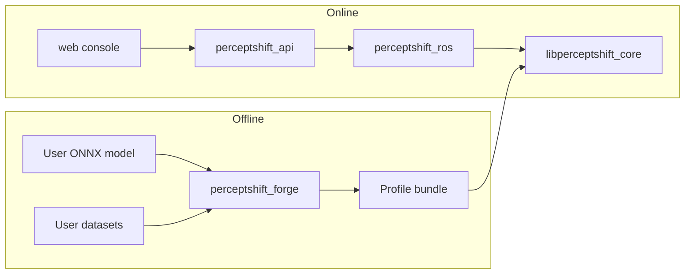

# Architecture

## Overview

PerceptShift separates offline orchestration from online inference:

| Layer | Ownership | Role |
|-------|-----------|------|
| `cpp/` | Core | Production inference engine, profiles, controller |
| `python/perceptshift_forge/` | Forge | Offline inspection, quantization, certification, reports |
| `python/perceptshift_cli/` | CLI | Operator commands |
| `python/perceptshift_api/` | API | Local operational HTTP/WebSocket API |
| `ros2_ws/` | ROS | Transport and lifecycle only |
| `web/` | Console | Presentation |
| `config/schemas/` | Contracts | Versioned JSON Schema source of truth |

## Component diagram

## Offline data flow

1. Operator supplies a licensed ONNX model and calibration/evaluation datasets.
2. Forge inspects the model, builds candidates, benchmarks the production path on the target host, and evaluates quality.
3. Only candidates that pass explicit gates are packaged into an integrity-protected profile bundle.
4. Reports are generated from measured artifacts; unavailable metrics are marked unavailable with reason codes.

## Runtime data flow

1. ROS lifecycle node configures with a user-supplied bundle path.
2. Core verifies integrity (and optional signature), warms eligible profiles, and selects a startup profile.
3. Image intake validates encodings and keeps a bounded latest-frame queue.
4. Inference runs in a dedicated worker (not in the subscription callback).
5. Normalized outputs, health, traces, switch events, and control-hold requests are published.

## Thread and process model

- ROS callbacks: image intake, services/control, telemetry (separate callback groups).
- Core inference worker: preprocess → session → postprocess.
- Forge inspect/bench workers: isolated child processes with timeouts and resource limits.
- API: local process; mutations require a token when enabled.

## Trust boundaries

See [threat-model.md](threat-model.md). Critical boundaries include user-supplied models/datasets, bundle import, forge→worker, ROS graph, local API, and filesystem.

## Fail-closed behavior

When no eligible profile remains, the runtime:

- transitions internal health to fail-closed;
- publishes a **control-hold request** (advisory to upstream control);
- does not publish actuator velocity commands by default.

## Extension points

- Model adapters (classification, YOLO v8 detection, raw tensor)
- Schema-versioned configs under `config/schemas/`
- Optional power/thermal providers

Schemas are authoritative; generated types must contract-test against them.
